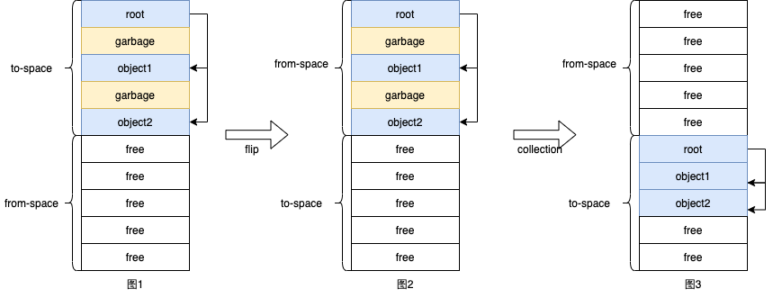
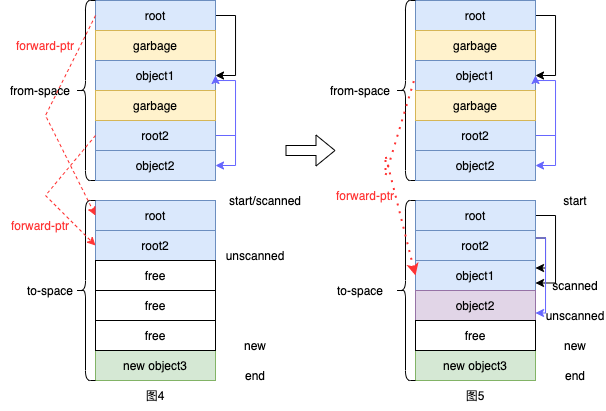
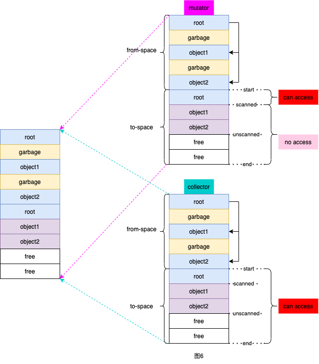

[toc]

# Baker's garbage collection笔记

## 背景

在阅读《Virtual Memory Primitives for User Programs》这篇论文时，其介绍的第一个应用就是基于Baker算法的垃圾回收机制。6.S081在该节的课程中也重点讲解了该算法并提供了一个简单版实现，因此打算做一下笔记。该笔记不是详细讲解垃圾回收算法，只是记录自己从零开始简单理解该垃圾回收机制和实现。

## 基本概念

在第一次看论文的时候，有很多概念都比较模糊，经过一番查询和思考，对以下概念作了一定浅见：

1. mutator：结合上下文，有时理解为用户线程，有时理解为一块地址空间。
2. collector：结合上下文，有时理解为回收线程，有时理解为一块地址空间。
3. From-space：待回收对象所在区域。
4. To-space：用户访问对象所在的区域。
5. scanned/unscanned：划分了To-space，对象在scanned区域可以被直接访问，在unscanned区域则需要进行scan后才能访问。
6. root：根节点，所有可使用的对象都可从根节点遍历得到。

## 算法分析

《Real-time Concurrent Collection on Stock Multiprocessors》这篇论文和《Virtual Memory Primitives for User Programs》是同一个作者，该论文比较具体地描述了如何利用虚拟内存实现Baker算法，其首先提到了一种Stop-and-Copy Collection的垃圾回收机制。

### Stop-and-Copy Collection

首先要明确执行垃圾回收的时间，在论文中有【At the beginning of a collection】的字眼，一开始我以为collection是一直在后台执行的，后面才发现，其实只有当用户new一个对象时空间不足，才开始执行collection。在Stop-and-Copy Collection的方法中：

* 首先将内存空间分为from-space和to-space，用户分配和使用的对象都在to-space上如下图1。
* 当to-space空间用尽，用户无法再通过new分配一个对象时，会准备开始collection，不过首先会将from-space和to-space的地址互换（flip），如下图2所示。
* 接着正式开始collection，把from-space中从root对象能到达的对象复制到to-space上，如下图3的object1和object2；然后清空from-space空间，完成collection。此时用户又可以在to-space上愉快地new一个对象了~



在论文上还有诸如scanned、unscanned和forwarding（转发）的概念，这些东西其实是为了更好地实现把对象从from-space复制到to-space。如下图4所示，有两个root指针，root指向object1，root2指向object1和object2。

*  首先有明确一点，一个object被scan，从unscanned变scanned，其实就是将其指向的地址内容从from-space复制到to-space，然后更新其指向的地址。

* 在collection的开始，会先将两个root复制到to-space，此时scanned指向start，unscanned指向root2，说明这两对象还没被scan。同时在复制完成后，from-space的两个root会各自生成一个forward-ptr指向to-space的root。
* 这个forward-ptr的作用是啥，是为了解决一个object被多个指针指向时的复制情况。如图5所示，假设scan到root，会复制object1并且生成一个forward-ptr。当scan到root2时，发现其指向的object1有forward-ptr，说明复制过了，于是更新指针指向forward-ptr地址即可，接着继续复制其指向的object2。
* 如图5所示，object2还没开始scan，所以unscanned指向object2。当object2也遍历完了，即scanned=unscanned时，说明root们的可达对象已经从from-space复制完了，collection结束。



那何为Stop-and-Copy呢？其实该算法在collection开始阶段，会阻塞用户执行，直至collection结束，才会恢复用户执行。所以该算法不是实时的垃圾回收算法，回收阶段会长时间挂起用户进程。

### Baker's Algorithm

Baker算法改进了上诉算法，使其变成了一个实时的垃圾回收算法。简单来说，Baker算法就是将复制的开销均摊在每次new的操作上，所以又称为增量(incremental)垃圾回收算法。

具体而言，有以下一些要点：

1. 在collection开始时，复制完root们到to-space之后，就恢复用户执行。
2. 当用户执行new操作分配新对象时，会从to-space中scan一部分的object，这里的一部分可以是一个PAGESIZE。
3. 由于用户只会使用到to-space中的对象，所以用户每次操作对象时，都需要先看看其是否在to-space。假如不在，则需要将其从from-space复制到to-space中。
4. 虽然在对象scan和复制的时候，用户进程还是要阻塞，但是上述2和3点都只需要操作一小部分的对象，阻塞时间很短，所以可认为该算法是实时的。

### Baker's Algorithm与Virtual-memory

那问题来了，讲了半天，baker算法和vm有什么关系呢？在上述的要点3中，用户每次操作对象都要先看看是否在to-space，这里会涉及到一些额外的指令，假设没有硬件的支持，每次操作都会比较慢，此时vm就派上用场了。使用VM，可以将不必每次获取对象都显式地判断对象是否在from-space，而是通过交给系统的page fault来隐式实现。简单来说，就是将to-space中unscanned区域的权限置为"no access"（保护权限），当用户访问unscanned区域的对象时，会触发page fault，在page fault中，用户自定义的函数会将unscanned区域中一个page的对象进行scan，然后再将该page权限置为可访问，恢复用户执行。此时用户就能正常访问该page的对象了。

具体而言，有一下一些要点：

1. 看到这里有好奇的小伙伴会问，同一块区域怎么能做到用户的权限是不可访问的，但是在page fault中又能对其做扫描复制呢？其实这里就用到了论文中map2的技巧，将同一个内存映射到两个不同的地址，如图6所示，一个专门供用户（mutator）使用，一个专门供collector使用。在mutator的内存地址中，访问unscanned区域产生page fault时，可将page fault的地址（在mutator中）转为collector中的地址。由于在collector地址中，所有区域都是可以访问的，就操作对象从from-space到to-space的复制了。操作完后，再将page fault的地址置为可访问，恢复用户执行即可。
2. 由于mutator和collector映射的是同一内存，所以在collector视角做的操作，如指针的转发等，是直接影响到mutator视角的。
3. 在page fault中做scan时，只做一个page的对象scan，减少用户阻塞时间。如图6，假设一个PAGESIZE是2个object的大小，那么用户访问object1时，会scan object1和object2。
4. 若还不够理解，可见下文的代码分析。



Baker算法使用VM还有一个好处就是用户线程和collector可以做到一定的并行。具体而言，就是当用户访问mutator中scanned区域的对象时，collector可以在后台扫描unscanned区域，不影响用户的访问。

## 代码分析

Talk is cheap, show me the code。 6.S081提供了一个Baker算法的简单Demo，如果只是看论文而没看代码实现，我可能对该算法存在很多疑问，感谢Frans教授！我这里就部分重要代码进行分析，可结合上面我画的图进行理解。

### 场景

首先要理解该Demo的测试场景。该Demo开了一个用户线程，不断地生成链式列表但不释放空间，所以会造成很多垃圾数据，需要自己实现回收机制。每次生成一个列表都会让root_head和root_last指向其头尾，作为对该轮列表的引用，如同上述的root节点。

```c
// Only one type of object: list elements
struct elem {
  int val;
  struct elem *next;
};

// The roots of the mutator
struct elem *root_head;
struct elem *root_last;

void *
app_thread(void *x) {
  for (int i = 0; i < 1000; i++) {
    make_clist();
    check_clist(LISTSZ);
  }
}
```

### 生成不同space地址

这里的不同space地址有两个含义，一个是from+to space，一个是mutator和collector不同的space地址。Demo中通过set_spaces函数实现了space地址的设置，要点如下：

1. 通过shm_open系统调用，在内存中生成一块区域，然后通过mmap分别map到mutator和collector上。
2. from和to指针都是指向mutator区域的，所以下面to-space和from-space如无特殊说明，指是mutator上的地址。
3. 对于第一次的space生成，mutator中的to-space区域能直接使用，所以不需要设置保护权限。
4. 设置中断处理函数，当发生page fault时，对该页进行scan，然后取消保护权限，使其可读写。该页地址肯定只属于mutator中的to-space区域。

```c
// Address where from+to space is mapped for mutator
static void *mutator = NULL;
// Address where from+to space is mapped for collector
static void *collector = NULL;

static void
setup_spaces(void)
{
  struct sigaction act;
  int shm;
 
  // make a shm obj for to-space and from-space
  if ((shm = shm_open("baker", O_CREAT|O_RDWR|O_TRUNC, S_IRWXU)) < 0) {
    fprintf(stderr, "Couldn't shm_open: %s\n", strerror(errno));
    exit(EXIT_FAILURE);
  }
 
  if (shm_unlink("baker") != 0) {
    fprintf(stderr, "shm_unlink failed: %s\n", strerror(errno));
    exit(EXIT_FAILURE);
  }
   
  if (ftruncate(shm, TOFROM) != 0) {
    fprintf(stderr, "ftruncate failed: %s\n", strerror(errno));
    exit(EXIT_FAILURE);
  }
 
  // map it once for mutator
  mutator = mmap(NULL, TOFROM, PROT_READ|PROT_WRITE, MAP_SHARED, shm, 0);
  if (mutator == MAP_FAILED) {
    fprintf(stderr, "Couldn't mmap() from space; %s\n", strerror(errno));
    exit(EXIT_FAILURE);
  }
 
  // map it once for collector
  collector = mmap(NULL, TOFROM, PROT_READ|PROT_WRITE, MAP_SHARED, shm, 0);
  if (collector == MAP_FAILED) {
    fprintf(stderr, "Couldn't mmap() from space; %s\n", strerror(errno));
    exit(EXIT_FAILURE);
  }
 
  from = mutator;
  to = mutator + SPACESZ;
  to_free_start = to;
 
  // Register a signal handler to capture SIGSEGV.
  act.sa_sigaction = handle_sigsegv;
  act.sa_flags = SA_SIGINFO;
  sigemptyset(&act.sa_mask);
  if (sigaction(SIGSEGV, &act, NULL) == -1) {
    fprintf(stderr, "Couldn't set up SIGSEGV handler: %s\n", strerror(errno));
    exit(EXIT_FAILURE);
  }
}

static void
handle_sigsegv(int sig, siginfo_t *si, void *ctx)
{
  uintptr_t fault_addr = (uintptr_t)si->si_addr;
  double *page_base = (double *)align_down(fault_addr, PGSIZE);
 
  printf("fault at adddr %p (page %p)\n", fault_addr, page_base);
 
  pthread_mutex_lock(&lock);
  scan(page_base);
  pthread_mutex_unlock(&lock);
   
  if (mprotect(page_base, PGSIZE, PROT_READ|PROT_WRITE) < 0) {
    fprintf(stderr, "Couldn't mprotect to-space page; %s\n", strerror(errno));
    exit(EXIT_FAILURE);
  }
}
```

### new、alloc、filp、forward和scan

整个算法比较重点的就是new的实现了，从上述讨论中可知，当用户new一个对象时：1、若可分配空间不足，开启垃圾回收；2、从to-space中scan一部分的object。Demo实现中的to_free_start指针相当于上述图4中的new指针，不过新分配的空间不是从底部end开始分配，而是从头开始，这样实现可以不需要unscanned指针，to_free_start - scanned的区域就是unscanned区域了。

```c
struct elem *
new(void) {
  struct elem *n;
   
  pthread_mutex_lock(&lock);
  // 若to-space中还有unscanned的区域（to_free_start - scanned），进行一页的scan。
  if (collecting && scanned < to_free_start) {
    scan(scanned);
    if (scanned >= to_free_start) {
      end_collecting();
    }
  }
  // 可分配空间不足，开始垃圾回收
  if (to_free_start + sizeof(struct obj) >= to + SPACESZ) {
    flip();
  }
  n = (struct elem *) alloc();
  pthread_mutex_unlock(&lock);
   
  return n;
}
```

首先简单看下alloc函数实现，就是简单，从to-space分配空间。

```c
struct obj *
alloc() {
  struct obj *o = (struct obj *) to_free_start;
  assert(to_free_start + sizeof(struct obj) < to + SPACESZ);
  to_free_start += sizeof(struct obj);
  return o;
}
```

接着看下flip函数，有以下要点：

1. to-space和from-space地址互换，若采用VM，还需要对新的to-space设置保护权限，以便产生page fault。
2. 将root_head和root_last（此时在新的from-space上）复制到新的to-space上，此时to-space上存在两个木有被scan的object。当访问这两个root时，就会产生page fault。
3. pthread_cond_broadcast(&cond)，是为了唤醒后台的一个the_collector线程，后续会提到。
4. 将全局变量collecting置为1，使得下一次new时，会scan一部分的对象。

```c
void
flip() {
  char *tmp = to;
 
  printf("flip spaces\n");
 
  assert(!collecting);
  to = from;
  to_free_start = from;
  from = tmp;
 
  collecting = 1;
  scanned = to;
 
#ifdef VM
  if (mprotect(to, SPACESZ, PROT_NONE) < 0) {
    fprintf(stderr, "Couldn't unmap to space; %s\n", strerror(errno));
    exit(EXIT_FAILURE);
  }
#endif
 
  // move root_head and root_last to to-space
  root_head = (struct elem *) forward((struct obj *)root_head);
  root_last = (struct elem *) forward((struct obj *)root_last);
 
  pthread_cond_broadcast(&cond);
}
```

再看下forward函数：

1. 先看对象在不在from-space上，若在from-space且没有转发指针，说明该对象还没有复制到to-space，进行copy。
2. 若对象在from-space有转发指针，所以该对象已经在to-space上，直接返回转发指针的地址。
3. 若对象就在to-space上，直接返回地址即可。

在copy函数中，也比较有意思。copy函数会先把从alloc得到的地址（mutator上的）转化成collector的地址。因为若开启了VM模式，此时to-space区域是有保护权限，不能读写的。所以如代码所示，变量o由于是在from-space上的，可直接操作，alloc出来地址是to-space上的，所以需先转变成collector上的再操作（回忆图6，在collector操作会反映在mutator上），操作完毕后再将地址转回mutator并返回。

```c
struct obj *
forward(struct obj *o) {
  struct obj *n = o;
  if (in_from(o)) {
    if (o->newaddr == 0) {   // not copied yet?
      n = copy(o);
      printf("forward: copy %p (%d) to %p\n", o, o->e.val, n);
    } else {
      n = o->newaddr;
      printf("forward: already copied %p (%d) to %p\n", o, o->e.val, n);
    }
  }
  return n;
}

struct obj *
copy(struct obj *o) {
  struct obj *n = gcaddr(alloc());
  n->e = o->e;
  o->newaddr = n;
  n->newaddr = NULL;
  return (appaddr(n));
}

// Convert from collector address to app address
void *
appaddr(void *a) {
  assert(a >= collector && a < collector + TOFROM);
  return (a - collector) + mutator;
}
 
// Convert from app address to gc address
void *
gcaddr(void *a) {
  assert(a >= mutator && a < mutator + TOFROM);
  return (a - mutator) + collector;
}
```

最后看看scan函数，也是先进行操作对象地址的转换，然后遍历一个PGSIZE的obj进行转发。这里要注意while的条件，当next大于to_free_start，说明已经没有obj需要扫描了。

```c
// Scan a page of unscanned objects and forward the pointers in the
// objects.
int
scan(void *start) {
  int sz = 0;
  void *next = gcaddr(start);
  printf("scan %p unscanned %p\n", gcaddr(start), gcaddr(to_free_start));
  while (next < gcaddr(start)+PGSIZE && next < gcaddr(to_free_start)) {
    struct obj *o = (struct obj *) next;
    if(o->e.next != 0)
      printf("scan: %p %d %p\n", o, o->e.val, o->e.next);
    o->e.next = (struct elem *) forward((struct obj *) (o->e.next));
    next += sizeof(struct obj);
  }
  scanned = appaddr(next);
  printf("scan done %p\n", to_free_start);
}
```

### 后台collector_thread线程和readptr

上述也提到，采用VM模式，可以在后台启动一个专门用于垃圾回收的线程，提高并发度。所以Demo也起了一个collector_thread。当全局变量collecting为0时，代表还没有开启新一轮的垃圾回收，该线程就阻塞，直至flip函数将其唤醒。

```c
void *
collector_thread(void *x) {
  printf("start collector\n");
  while (!done) {
    pthread_mutex_lock(&lock);
    if (collecting && scanned < to_free_start) {
      printf("collector: scan\n");
      scan(scanned);
      if (scanned >= to_free_start) {
        end_collecting();
      }
    }
    while (!collecting) {
      pthread_cond_wait(&cond, &lock);
    }
    pthread_mutex_unlock(&lock);
  }
  printf("done collector\n");
}
```

最后看看readptr，对于object中元素的操作都是通过readptr去获取。开启VM模式的话可直接返回地址，不开启的话就需每次获取前看看是否对象是否在to-space。之前有想过一个场景，若该列表一共有10个元素，此时前3个元素在to-space，剩下7个还在from-space等待复制，此时我访问第6个元素，若开启VM模式后，会直接返回from-space中的地址吗？其实不会，因为这是个链式列表，要想访问第6个元素，也必须先访问前面的元素，访问前面元素的时候，已经将第6个元素复制到to-space了。

```c
// Without VM: check if pointer should be forwarded.  With VM, do
// nothing; the segfault handler will fix things up and when it
// returns the pointer will be pointing to object in to-space.
struct elem *
__attribute__ ((noinline))
readptr(struct elem **p) {
#ifndef VM
  struct obj *o = forward((struct obj *) (*p));
  *p = (struct elem *) o;
#endif
  return *p;
}
```

### 其他

1. 最后再讲下Demo中obj类和elem类的关系。obj类内含一个elem元素和转发指针，对用户暴露的new接口和readptr接口都是返回的elem指针，在内部alloc、forward接口中返回的是obj指针。所以对用户来说是不感知操作变化的。
2. 由于这只是一个Demo，测试场景比较简单，都是顺序访问，所以还不够完善，比如没有涉及到并发new等问题。

## 总结

通过本次的学习，了解到一些垃圾回收的机制和Baker算法的简单实现；也知道了linux系统调用的强大，可以利用这些系统调用在用户侧实现一些意想不到的效果。

## Reference

1. https://pdos.csail.mit.edu/6.S081/2020/readings/appel-li.pdf
2. https://www.cs.tufts.edu/comp/150FP/archive/andrew-appel/real-time-gc.pdf
3. https://pdos.csail.mit.edu/6.S081/2020/lec/baker.c
4. http://infolab.stanford.edu/~ullman/dragon/w06/lectures/gc.pdf

