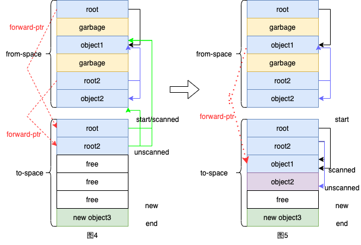

[toc]

# Baker's garbage collection笔记

## 背景

在阅读《Virtual Memory Primitives for User Programs》这篇论文时，其介绍的第一个应用就是基于Baker算法的垃圾回收机制。6.S081在该节的课程中，也是重点讲解了该算法并提供了一个简单版的实现，因此打算做一下笔记。该笔记不是详细讲解垃圾回收算法，只是记录自己从零开始简单理解该垃圾回收机制和实现。

## 基本概念

在第一次看论文的时候，有很多概念都比较模糊，经过一番查询和思考，对以下概念作了一定浅见：

1. mutator:可以理解为用户线程，会使用分配出来的对象。
2. collector:可以理解为一个后台线程，用于
3. From space
4. To space
5. scanned/unscanned
6. root

## 算法分析

《Real-time Concurrent Collection on Stock Multiprocessors》这篇论文和《Virtual Memory Primitives for User Programs》是同一个作者，该论文比较具体地描述了如何利用虚拟内存实现Baker算法，其首先提到了一种Stop-and-Copy Collection的垃圾回收机制。

### Stop-and-Copy Collection

首先要明确执行垃圾回收的时间，在论文中有【At the beginning of a collection】的字眼，一开始我以为collection是一直在后台执行的，后面才发现，其实只有当用户new一个对象时空间不足，才开始执行collection。在Stop-and-Copy Collection的方法中：

* 首先将内存空间分为from-space和to-space，用户分配和使用的对象都在to-space上如下图1。
* 当to-space空间用尽，用户无法再通过new分配一个对象时，会准备开始collection，不过首先会将from-space和to-space的地址互换（flip），如下图2所示。
* 接着正式开始collection，把from-space中从root对象能到达的对象复制到to-space上，如下图3的object1和object2；然后清空from-space空间，完成collection。此时用户又可以在to-space上愉快地new一个对象了~

在论文上还有诸如scanned、unscanned和forwarding（转发）的概念，这些东西其实是为了更好地实现把对象从from-space复制到to-space。如下图4所示，有两个root指针，root指向object1，root2指向object1和object2。

* 一开始，先将两个root复制到to-space，此时scanned是等于start的，因为只是做了复制，还没开始遍历两个root的内容。同时复制完成后，from-space的两个root会各自生成一个forward-ptr指向to-space的root。
* 这个forward-ptr的作用是啥，是为了解决一个object被多个指针指向时的复制情况。如图5所示，假设scan到root，会复制object1并且生成一个forward-ptr。当scan到root2时，发现object1已经复制过了，有forward-ptr，于是就指向forward-ptr的地址即可，然后继续复制object2。
* 如图5所示，object2还没开始遍历，所以unscanned指向object2。当object2也遍历完了，即scanned=unscanned时，说明root们的可达对象已经从from-space复制完了，collection结束。

那何为Stop-and-Copy呢？其实该算法在collection开始时，会阻塞用户执行，直到复制完成，collection结束，才会恢复用户执行。所以该算法不是实时的垃圾回收算法，回收阶段会长时间挂起用户进程。

### Baker's Algorithm

Baker算法改进了上诉算法，使其变成了一个实时的垃圾回收算法。简单来说，Baker算法就是将复制的开销均摊在每次new的操作上，所以又称为增量(incrememting)垃圾回收算法。

具体而言，有以下一些要点：

1. 在collection开始时，flip了space之后，只复制root们，然后就恢复用户执行。
2. 当用户执行new操作分配新对象时，会从to-space中的scanned一部分的object，这里的一部分可以是一个PAGESIZE。
3. 由于用户只会使用到to-space的对象，所以用户每次操作对象时，都需要先看看其是否在to-space。假如不在，则需要从from-space复制到to-space中。
4. 虽然在对象复制的时候，用户进程还是要阻塞，但是上述2和3点都只需要复制一小部分的对象，阻塞时间很短，所以可认为该算法是实时的。

### Baker's Algorithm与virtual-memory

那最后的问题来了，讲了半天，baker算法和vm有什么关系呢？在上述的要点3中，用户每次操作对象都要先看看是否在to-space，这里会涉及到一些额外的指令，假设没有硬件的支持，会比较慢。此时vm就派上用场了，可以

## 代码分析

bug 内存不足

## Ref

1. https://pdos.csail.mit.edu/6.S081/2020/readings/appel-li.pdf
2. https://www.cs.tufts.edu/comp/150FP/archive/andrew-appel/real-time-gc.pdf
3. https://pdos.csail.mit.edu/6.S081/2020/lec/baker.c
4. http://infolab.stanford.edu/~ullman/dragon/w06/lectures/gc.pdf

