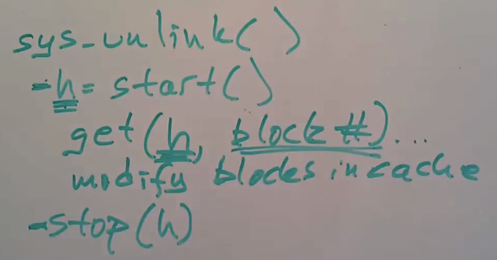

# Journaling the Linux ext2fs Filesystem

Authors: Stephen C. Tweedie
Fields: Linux, filesystem
Priority: medium
Read: Yes
Year: 1998

## Paper in 3 Sentences

1. 介绍了一种日志实现机制，可以在ext2fs的文件系统上实现崩溃后的恢复。
2. 该机制只需在ext2fs上做少许的修改。

## Impressions

在考虑文件系统的可靠性时，有以下几点可考虑：

1. Preservation：data which was stable on disk before the crash should never ever be damaged.
2. Predictability: the failure modes from which we have to recover should be predictable in order for us to recover reliably.
3. Atomicity:  Recovery is atomic if such filesystem operations are either fully completed on disk or fully undone after recovery finishes.

## Top 3 Quotes

- 

## Notes

1. 日志等级有三种，该paper主要讨论Ordered的等级。
    1. journal，最低风险，因为metadata和文件内容都会先写日志。
    2. Ordered，中等风险，只有metadata会写日志，保证metadata写日志前，文件内容能落盘。这是很多linux系统默认的模式。若是新创建文件或append文件这种模式在崩溃后恢复没有一致性的问题，但是如果是overwrite的话，崩溃后恢复是会损坏文件的。因为若metadata还没写日志前，overwrite的内容落盘了，此时发生崩溃，因为旧的文件内容没有保存，造成一致性问题。
    3. WriteBack，最高风险，只有metadata写日志，但是不保证文件内容在meta写日志前落盘。
2. 一些概念
    1. 每个事务可以包含多个文件系统调用。
    2. 每个事务包换一个序列号、要修改的block编号，Handles.
3. 日志结构
    1. Super block：会记录首个需恢复事务的offset和事务序列号，崩溃后恢复时，从该事务可以一直遍历进行恢复。
    2. Descriptor：记录该事务要修改的block编号（回写到原来磁盘的block编号），序列号，有个magic number区分数据block。
    3. 数据块。
    4. Commit block：记录了该事务的序列号。有一个magic number区分数据block
    5. 日志是环形buffer。
    6. 
4. 获得高性能的原因（与xv6相比）：
    1. ASYNC
        1. 系统调用的异步的。
        2. 好处：可以有IO并发，可以批处理。
        3. 坏处：系统调用返回后，数据不一定落盘，所以一般提供fsync(fd)这样的接口。
    2. BATCHING
        1. 每隔一段时间（如5s）开启新一轮的事务，commit上一轮的事务。
        2. 所以一段事务中，包含了多个系统调用，包含大批量写。
        3. 好处：write absorpiton，优化磁盘调度，因为日志顺序写。
    3. CONCURRENCY
        1. 系统调用并发。
        2. 多事务（不同状态间）的并发，个人理解可以每个状态一个线程去并发完成，但是事务提交顺序还是要严格保持一致。事务依次状态如下：
            1. one open
            2. commiting to log
            3. Writing to home
            4. freed
        3. 若不同事务并发之间有影响，假设事务A在commiting，但是事务B要修改事务A中的block，此时可能会造成事务A的commiting包含事务B的修改。解决办法是，事务A在commiting前会copy一份blocks专门用于commit，此时事务B可以在原blocks上修改。为了高性能，可以用copy-on-write。
5. 简单流程：
    1. 每个系统都用都会先获取一个handler，用于标识属于哪个事务。当间隔时间到且该事务所有的系统调用完成了，如调用完stop了，就可以进行commit；若该轮事务的系统调用还没完毕，则要等其完毕后才能创建新的事务。这里的等待也是为了不让新事务影响旧事务的修改，假设旧事务在创建一个文件，新分配的inode是由新事务释放的，那就造成了干扰。另外，开始commit的时候，要阻塞所有新的系统调用。
    2. 
    3. 
        1. 阻塞新系统调用（影响一定的性能）。
        2. 等待现有系统调用完成。
        3. 开启新一轮事务。
        4. 依次写描述块，写block到日志，写commit。最后回写至home locations，释放日志空间。这些都是在后台运行。
6. 其他：
    1. 事务需要预先估计大小，确保日志还有剩余空间。
    2. magic number区分描述块、commit块和数据块。以下场景，若T5已经被释放了，T8覆盖了T5的部分空间，崩溃后恢复如何判断T8是否是在commit的事务。
        1. 
        2. 可从T8的描述块中找到该事务需修改的block数，然后在日志中的对应偏移看看是否存在commit块。为防止T5的旧数据中，刚好有magic number，可做这样的处理：当事务的数据块中以magic number为开始的，就将其部分置为0，然后在描述块中记录该数据块，在恢复的时候再将其复原。
    3. extfs4中能同时写数据块和commit块，减少磁盘等待时间，但需要增加一个checksum。
        1. 

## Useful References

1. [https://en.wikipedia.org/wiki/Ext3](https://en.wikipedia.org/wiki/Ext3)
2. MIT6.s086 LEC 16

## URL

1. [https://pdos.csail.mit.edu/6.S081/2020/readings/journal-design.pdf](https://pdos.csail.mit.edu/6.S081/2020/readings/journal-design.pdf)
